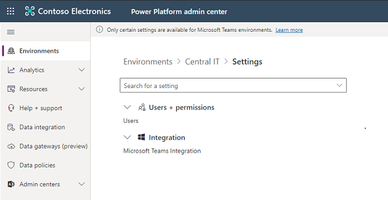
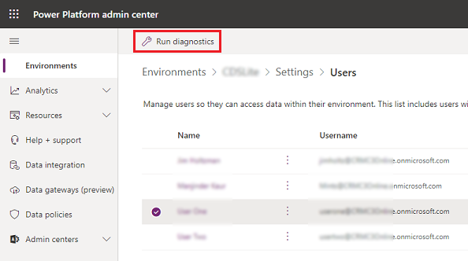
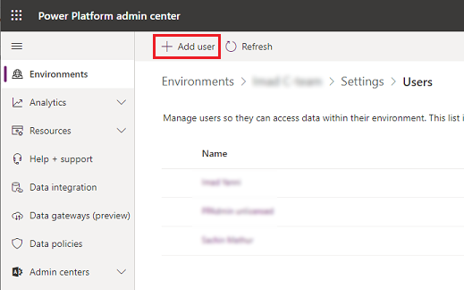
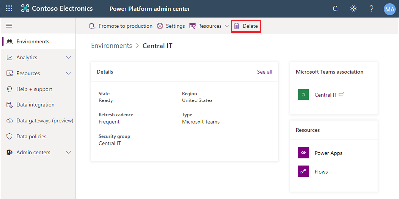

# About the Microsoft Dataverse for Teams environment
<!-- fwlink 2143567 -->

[!INCLUDE [cc-data-platform-banner](../includes/cc-data-platform-banner.md)]

Introduced in September, 2020, *Microsoft Dataverse for Teams* is a built-in, low-code data platform for Microsoft Teams that empowers users to build custom apps, bots, and flows in Teams by using Power Apps, Power Virtual Agents, and Power Automate. Dataverse for Teams—built on Microsoft Dataverse—provides relational data storage, rich data types, enterprise-grade governance, and one-click solution deployment to the Teams app store. More information: [Dataverse for Teams overview](/powerapps/teams/overview-data-platform)

The Dataverse for Teams environment is automatically created for the selected team when you create an [app](https://docs.microsoft.com/powerapps/teams/create-first-app) or [bot](https://docs.microsoft.com/power-virtual-agents/teams/authoring-first-bot-teams#create-a-bot) in Teams for the first time or install a Power Apps app from the app catalog for the first time. The Dataverse for Teams environment is used to store, manage, and share team-specific data, apps, and flows. Each team can have one environment, and all data, apps, bots, and flows created with the Power Apps app inside a team are available from that team's Dataverse for Teams database.  

> [!NOTE]
> The capability to upgrade Dataverse for Teams environments to Dataverse environments isn’t available yet. Check back later for availability.

You can identify a Dataverse for Teams environment in the [Power Platform admin center](https://admin.powerplatform.microsoft.com) by using the **Type** column in the list of environments.

> [!div class="mx-imgBorder"] 
> 

## Licensing and restrictions

Note the following regarding access to Microsoft Power Platform apps in Teams.

- Dataverse for Teams will be available as part of select Microsoft 365 subscriptions with Power Platform and Teams capabilities, excluding plans for US government environments (GCC, GCC High and DoD) and EDU A1 and SUB SKUs. 

- Apps created in Teams that use Dataverse for Teams will only be accessible in Teams and Teams Mobile, regardless of the user's license.  

- For any standalone Power Apps or Power Automate usage, which includes Dataverse API access as well, the Dataverse for Teams environment will need to be upgraded to Microsoft Dataverse.  

- Teams can invite guests who can access the apps, bots, flows, and data in the Dataverse for Teams database within their team. However, they won't be allowed to install, make, or edit apps. They can only discover and run apps in their team.

- No direct API access to the Dataverse for Teams will be provided, and only apps, bots, and flows embedded within the Teams client will be able to access the Dataverse for Teams runtime.

See: [Dataverse for Teams licensing FAQ](powerapps-flow-licensing-faq.md#dataverse-for-teams)

## Environment lifecycle

This section provides a summary of key lifecycle operations that will be allowed with Dataverse for Teams environments.

> [!NOTE]
> The Dataverse for Teams environment name is the same as the team name. You can filter the list of environments in the Power Platform admin center to show just Dataverse for Teams environments.

|Operations  |Feature description  |Available in GA  |
|---------|---------|---------|
|Backup     | Automated backups and labeled backups can be taken. Admins can view them in the Power Platform admin center. Backups will be available for up to 7 days.        |  Yes       |
|Restore     | Only point-in-time restores to the same environment will be possible. Note: if the environment has been upgraded, the point-in-time restore will only be available starting from the moment it was upgraded. | Yes        |
|Copy     | Not available by default for Dataverse for Teams environments.        | No        |
|Create     | Only through Teams. Note: these Dataverse for Teams environments will be limited to a 1:1 mapping to the Teams team it was created in and bound to the Microsoft 365 group associated with the team.        | No        |
|Delete     | The environment can be deleted by the team owner. Note: the environment will be deleted automatically if the team it was created in is also deleted.| Yes  |
|Reset     | Not available by default for Dataverse for Teams environments.        | No        |
|Upgrade     | Unlocks all the functionality of Dataverse services for the environment.         | No        | 

The lifetime of the environment will be tied to the team it was created in. If you upgrade an environment to Dataverse, the 1:1 mapping isn't guaranteed because the environment can now be used by applications outside of Teams. The upgraded environment is bound by the lifecycle rules associated with the Power Apps license and the configuration of the environment.

Some operations are blocked by default, such as the Copy and Reset operations. For scenarios where you need this capability, use Dataverse environments. See the previous table for details.

> [!IMPORTANT]
> Dataverse for Teams environments won't be allowed to change types until the upgrade operation has been carried out on the environment. After the upgrade is complete, the Dataverse for Teams environment will have the full capabilities found in Dataverse.  
>
> If the team is deleted, the Dataverse for Teams environment that was created will also be deleted. The Dataverse for Teams environment itself may be deleted from within the team by the team owner. A warning will be provided prior to allowing the deletion to go through, to ensure there are no accidental deletions. 

## User access to Dataverse for Teams environments

In an environment such as Dataverse for Teams that can be collaborative in the development and use of apps, bots, and data, it's important to understand how access is granted to the different types of roles within the service.

This section summarizes user access to Dataverse for Teams environments and resources.

### Conceptual model

Every team in Teams is linked 1:1 to a [Microsoft 365 group](https://docs.microsoft.com/microsoft-365/admin/create-groups/office-365-groups?view=o365-worldwide).

Microsoft 365 Groups supports two user membership types: owners and members. Members can be users from the customer's own tenant or from a guest tenant. Any user management (addition, removal, user type change) made in a team will be reflected in the Microsoft 365 group, and vice versa.

Access to a Dataverse for Teams environment and its resources (apps, data) will be restricted to users in the team. The Microsoft 365 group linked to a team will be automatically associated with the Dataverse for Teams environment, restricting access to users of that group. This Microsoft 365 Group's association with the Dataverse for Teams environment won't be editable until the environment is upgraded to Dataverse.

There is a difference in the model for user addition to environment, between Dataverse environments and Dataverse for Teams environments. This table describes the differences:

|Feature  |Dataverse for Teams  |Dataverse  |
|---------|---------|---------|
|Automatic addition of all users in the Microsoft 365 group associated with the environment    |  No       |  Yes       |
|Just-In-Time addition of users on their first access of a resource in the environment      |  Yes       |  Yes       |
|On-demand addition of users (refer to [Add users to an environment](add-users-to-environment.md))      |  Yes       |  Yes       |

### Role assignments 

<table style="width:100%">
<tr>
<th>Persona</th>
<th>Description</th>
<th>Security role auto-assigned</th>
</tr>
<tr>
<td width="20%"> Teams owner </td>
<td width="50%"> Owners can manage team membership and settings in the team. They have full access to the Dataverse for Teams environment's apps, resources, and data. They can perform environment maintenance tasks such as backup and restore through the Power Platform admin center.</td>
<td width="30%"> System Administrator   </td>
</tr>
<tr>
<td width="20%"> Teams member </td>
<td width="50%"> Members can view the Dataverse for Teams environment's resources, run all apps and resources, and create or update their own resources. They have full access to all data. </td>
<td width="30%"> Teams Member </td>
</tr>
<tr>
<td width="20%"> Teams guest</td>
<td width="50%">  Guests are people from outside the tenant that a team owner invites, such as a partner or a customer. They can view and run all resources in the team. By default, guests have full access to records they create and don't have access to other users' records. </td>
<td width="30%"> Teams Guest</td>
</tr>
<tr>
<td width="20%"> Global admin / Power Platform admin</td>
<td width="50%"> These are tenant-level admins who manage the health and maintenance of the tenant's environments. They need not be owners or members of the team, but through their tenant-level admin privileges they can perform environment maintenance tasks such as backup and restore for all Dataverse for Teams environments. Similar to Dataverse, these tenant-level admins will have System Administrator privileges with Read-Write access mode to Dataverse for Teams environments. </td>
<td width="30%"> System Administrator  </td>
</tr>
<tr>
<td width="20%"> Dynamics 365 admin </td>
<td width="50%"> These admins need to be owners or members of the team (since every team is linked to an Microsoft 365 group and the Dataverse for Teams environment will always be restricted for access to that Microsoft 365 group) in order to have System Administrator level privileges to manage the health and maintenance of the environment. </td>
<td width="30%"> System Administrator if they are an owner in the team; System Administrator and Teams Member if they are a member in the team. No access if they are not an owner or member in the team. </td>
</tr>
<tr>
<td width="20%"> Colleagues with access </td>
<td width="50%"> Colleagues with access are people in the tenant who aren't in the team but have been invited to run apps in the team. By default, colleagues with access have no access to data. Their data access rights can be granted based on the app or resources that they need to run. Note: when a colleague with access is invited to run apps in a team, the Microsoft 365 group association with the team's Dataverse for Teams environment will be automatically removed to allow app run access to the colleague with access. </td>
<td width="30%"> Common Data Service User</td>
</tr>
</table>

> [!NOTE]
> [Record sharing](wp-security-cds.md#record-sharing) isn't supported in Dataverse for Teams.  You can't share a record with another user or team.

## Dataverse for Teams environments settings and actions
<!-- fwlink 2133713 2134780(settings) 213924(backup/restore) -->

To change settings for a Dataverse for Teams environment, go to **Environments** > [select a Dataverse for Teams environment] > **Settings**.

> [!div class="mx-imgBorder"] 
> 

### Users + permissions
<!-- fwlink 2123134 2127762 -->

You can specify users in an environment to provide access to Dataverse for Teams environment apps, bots, and data.

1. In the [Power Platform admin center](https://admin.powerplatform.microsoft.com), select **Environments** on the left pane, and then select a Dataverse for Teams environment.

2. Select **Settings**.

3. Select **Users + permissions**, and then select **Users**.

4. You'll see a list of enabled and disabled users who are members of the Dataverse for Teams environment. You can select a user from the list to run diagnostics and view their access details and status.

   > [!div class="mx-imgBorder"] 
   >  

5. Select **+ Add user** to add a tenant user to the selected Dataverse for Teams environment. 

   > [!div class="mx-imgBorder"] 
   >  

6. Enter a name or email address of a user who meets the user access requirements to add the user to the Dataverse for Teams environment, and then select **Add**.

   > [!div class="mx-imgBorder"] 
   >  

7. Select **Refresh** to see the added user in the list.

### Delete a Dataverse for Teams environment

To delete a Dataverse for Teams environment, select it from the list of environments and then select **Delete**.

> [!div class="mx-imgBorder"] 
> 

### Upgrade a Dataverse for Teams environment to production

Select **Upgrade to production**. See [Upgrade process](#upgrade-process).

## Capacity limits

The consumption of capacity by Dataverse for Teams environments won't count towards the tenant's capacity limits. Instead, we'll provide a pool of capacity for Dataverse for Teams environments, which will be separate from the tenant's Microsoft Power Platform Dataverse capacity pool. Capacity won't be transferable between these two pools.  

**Per-environment limits on Dataverse for Teams environments**: Each Dataverse for Teams environment provides 2 GB of combined database and file storage, with a portion of this amount reserved for system use. To see the consumption of each Dataverse for Teams environment in a tenant, go to the Power Platform admin center (https://aka.ms/ppac), then to **Resources** > **Capacity** > **Microsoft Teams Capacity**.

> [!div class="mx-imgBorder"] 
> 

**Tenant-wide limits on Dataverse for Teams environments**: Each tenant will also have limits related to Dataverse for Teams environments defined in the following table. 

|Unit  |Service limit  |
|---------|---------|
|Dataverse for Teams environments      | 5 + 1 per 20 eligible office seats (up to a maximum of 500 environments)   This limit on the number of environments can't be extended further. Should more instances be needed, consider deleting unused environments or upgrading to environments to Dataverse.   |
|Max Dataverse for Teams environment storage per tenant      | 10 GB + Dataverse for Teams environments &times; 2 GB (up to a max of 1 TB).   This storage limit can't be extended further. Should more storage be needed, consider upgrading environments to Dataverse.  |
|Max Dataverse for Teams environments API calls  | API requests in Microsoft Power Platform consist of various actions that a user makes across various products.    For more information about API calls and the per-user limits available, go to [Microsoft Power Platform request entitlements](https://aka.ms/PowerPlatformRequestEntitlements). |

### Enforcement

The following actions will be taken when customers approach and exceed the environment-level or tenant-wide Teams limits. 

#### Environment-level enforcement actions  

> [!NOTE]
> These environment-level enforcement actions will take effect soon after general availability. 

When a Dataverse for Teams environment in a team approaches or reaches the 2 GB capacity limit, the following actions will be taken: 
- At 80 percent of the limit, the Teams users will see in the Teams maker experience a message informing them the capacity limit is about to be reached. At this point, customers are encouraged to either reduce storage usage or contact their admin for other options.  
- At 100 percent of the limit, any existing apps, chatbots, and flows will continue to work and existing apps can be updated. However, new apps, bots, flows, and tables can't be created or installed as a result of having reached the capacity limit. 

#### Tenant-level enforcement  

> [!NOTE]
> These tenant-level enforcement actions will take effect at general availability.

When a tenant approaches or reaches their tenant-wide Teams limits described earlier, the following actions will be taken: 
- At 80 percent of the limit, a notification that capacity is reaching its limit will be sent to the Power Platform center admin. The admin will be encouraged to consider reducing storage usage or upgrading some of the Dataverse for Teams environments.
- At 100 percent of the limit, the creation of new Dataverse for Teams environments will be blocked. Any users attempting to create a new Dataverse for Teams environment will be prompted to contact the tenant admin as the result of the capacity limit being reached. Additionally, new apps, chatbots, flows, and tables won't be allowed to be created or installed in any existing Dataverse for Teams environment.  

As mentioned for the environment-level enforcement, any existing apps will still be able to function as expected.  

## Upgrade process 
<!-- fwlink 2122620 for failure need 1GB -->
<!-- fwlink 2134779 for for a few thing to know -->

> [!IMPORTANT]
> The capability to upgrade Dataverse for Teams environments to Dataverse environments isn’t available yet. Check back later for availability.
 
The high-level flow and business rules for upgrading a Dataverse for Teams environment follow. 

A tenant admin will be allowed to upgrade a Dataverse for Teams environment to a Dataverse database environment. A typical flow is as follows:  

:::image type="content" source="media/teams-environment-promotion-process.png" alt-text="Dataverse for Teams environment upgrade process":::

1. Within a team, the Teams user chooses to create an app by using the new integrated Power Apps app creation experience in Teams, or by installing an existing Dataverse for Teams environment-based app. At this point, a Dataverse for Teams environment is provisioned for that team.  

2. Over time, the data stored in the Dataverse for Teams environment will grow and eventually reach the capacity limit that these environments have (2 GB). At this point, existing apps will continue to operate but new applications won't be allowed to be created or installed. Customers will be directed to contact a tenant admin to upgrade the Dataverse for Teams environments to Dataverse and obtain more capacity. Alternatively, a Teams user can request that the admin upgrade the environment because they want to use a certain feature in Dataverse.  

3. Admins will review the request from the Teams user and make the decision to upgrade the environment from Teams to Dataverse. At this point, the admin will go to the Power Platform admin center environments view to execute the upgrade.   

   > [!NOTE]
   > To successfully carry out the upgrade, the tenant must have at least as much available capacity as the size of the Dataverse for Teams environment that's being upgraded. After its upgrade, the consumed capacity of the upgraded Dataverse for Teams environment will start counting towards the tenant's capacity. If an attempt is made to upgrade a Dataverse for Teams environment when the tenant doesn't have enough capacity, the upgrade operation will be blocked and an error message will be displayed.

4. Admins will be given a message with the implications of upgrading and asked to confirm the action.  

5. If the admin confirms, the upgrade will go forward. As the upgrade progresses, various notifications will be provided as the operation transitions through the various states.  

After upgrade, the following applies to the newly upgraded environment:  
- The upgraded environment's lifecycle will no longer be tied to the lifecycle of that team. If the team is deleted, the upgraded environment remains. 
- Any apps running on the environment will require Microsoft Power Platform (Power Apps, Power Automate) licenses to be accessed. 
- The apps can run inside and outside of Teams. 
- All existing apps will be associated with the upgraded environment (Dataverse) and can take advantage of the extended set of entities. 
- The upgraded environment capacity will start counting against the tenant's Dataverse capacity. 
- The Microsoft 365 Groups association will become editable. 
- Team owners are assigned the System Admin roles on their environment and can access the environment by using the Power Platform admin center. 
- Adding a new Teams Template app to the former team won't create a new Dataverse for Teams environment for the team. 

## Ability to govern Dataverse for Teams

The ability to create apps or bots with the new Power Apps and Power Virtual Agents apps is enabled by default in Teams. Admins can enable or disable it for specific users by using the Teams apps permission policies in Teams.

In your Teams admin center, you can use **Power Apps** and **Power Virtual Agents** applications available under **Microsoft Apps** to enable or disable these new capabilities for specific users. More information: [Manage app permission policies in Microsoft Teams](https://docs.microsoft.com/microsoftteams/teams-app-permission-policies)

In addition to the new experience of creating apps or bots with Power Apps and Power Virtual Agents, users can now use sample apps to instantiate Teams apps (and associated Dataverse for Teams environments). Available sample apps are listed [here](https://docs.microsoft.com/powerapps/teams/use-sample-apps-from-teams-store). You can enable or disable these apps for specific users by using the Teams apps permissions policies. For example, for app permissions policies under **Microsoft Apps** in the Teams admin center, you'll find **Employee Ideas**, **Inspection**, and **Issue Reporting** sample apps.

Note that when the Power Apps app is disabled, users won't have access to any standalone apps that you pinned in their Teams channels with the Power Apps app. For users to continue using standalone apps in the Teams experience even after the Power Apps maker experience has been turned off for them, you can use the new **Built by your colleagues** catalog entry point to pin standalone apps to Teams channels or a user's personal scope. This action only needs to be performed once: it updates the experience for all members of the team, allowing them to use existing apps they already had access to. We recommend that if you choose to disable Power Apps for any user in your tenant, you advise them that they can use the **Built by your colleagues** catalog to restore the standalone apps they were using before in Teams channels. For more information about this entry point and corresponding controls, see [Manage Microsoft Power Platform apps in the Microsoft Teams admin center](https://docs.microsoft.com/microsoftteams/manage-power-platform-apps).

The **Built by your colleagues** catalog intentionally filters out 'Shared with Everyone’ apps. These apps can be added to the Teams app catalog leveraging the ‘Upload a custom app’ capability in Teams. See [Publish a custom app by uploading an app package](https://docs.microsoft.com/microsoftteams/upload-custom-apps).

> [!NOTE]
> Microsoft Power Platform data governance policies like data loss prevention and tenant isolation apply to Teams and Dataverse for Teams environments, similar to other environment types.

## Known issues

- The **Run diagnostics**" feature in the Power Platform admin center for team owners, members, and guests who don't have Azure Active Directory admin roles like Global Admin, or Power Platform Admin assigned, will show an alert that no security roles have been assigned directly to them. Security roles are auto-assigned by the SYSTEM for Team personas, so this alert can be ignored.

### See also
[Power Apps and Teams](https://docs.microsoft.com/powerapps/teams/overview)  
[Power Automate and Teams](https://docs.microsoft.com/power-automate/teams/overview) 
[Power Virtual Agents and Teams](https://aka.ms/pva-teams-docs) 
[Enable Microsoft Teams Integration for model-driven apps](enable-teams-integration.md)
